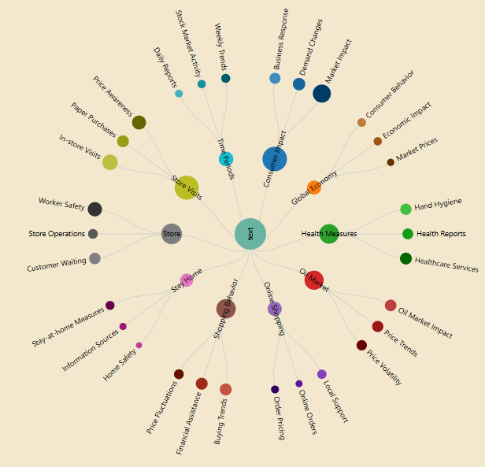
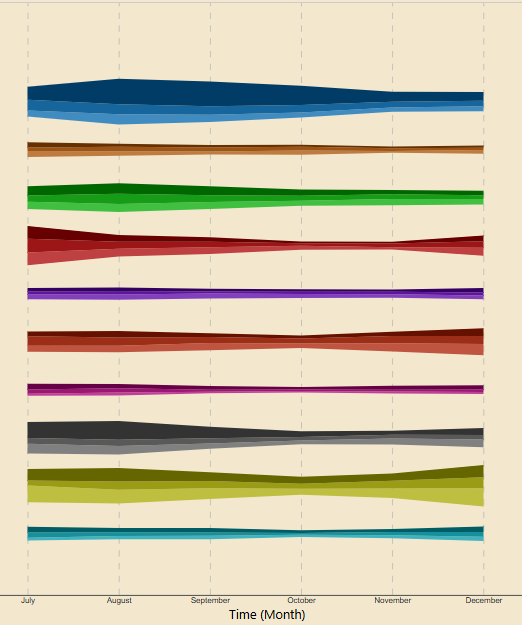
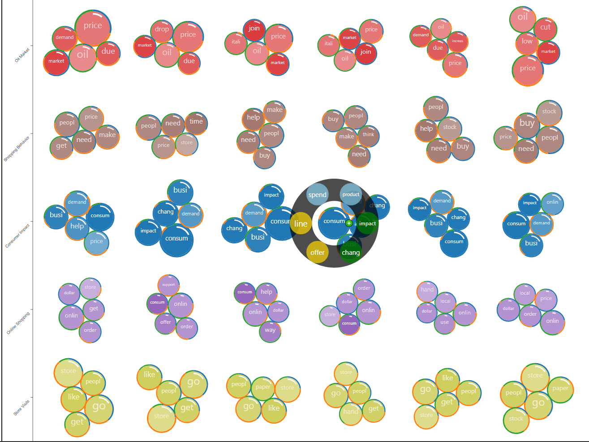
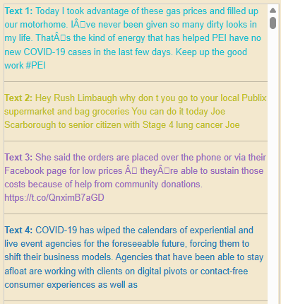
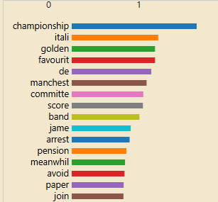
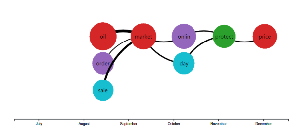

# TopicBubbler

An interactive visual analytics system for cross-level fine-grained exploration of social media data.

## Overview

TopicBubbler is a pioneering solution designed to navigate and extract insights from the vast landscape of social media data. With its hierarchical structure and cross-level exploration capabilities, this system empowers users to analyze social media content with precision and depth.

## Features

- **Hierarchical Structure View**: A radial tree diagram presenting the visual hierarchy of topics.  

  

- **Temporal View**: Provides insights into temporal trends across hierarchical levels.  

  

- **Fine-grained Exploration View**: Facilitates correlation analysis through bubble plots.  

  

- **Document View**: Entry point for examining original comment documents.

  

- **Keyword Ranking View**: Analyze and arrange keywords based on intensity levels.  

  

- **Event Evolution View**: Construct narrative timelines by selecting keywords.  

  

## Dataset

The system utilizes coronavirus-related tweets from Hugging Face, covering July 2020 to December 2020. The dataset comprises 44,955 rows and 13 attributes.

## Technical Implementation

- Data preprocessing pipeline converting parquet to CSV format.
- Text standardization and sanitization.
- LDA (Latent Dirichlet Allocation) algorithm for topic generation.
- Keyword correlation calculation.
- Dynamic data processing via FAST-API Python application.
- Recommendation algorithms:
    - **Relevance Recommendation Algorithm**
    - **Frequency Recommendation Algorithm**

## Extensions

- Interactive tooltips for detailed insights.
- Highlighting of recommended keywords.
- Feature to remove mistakenly selected keywords.
